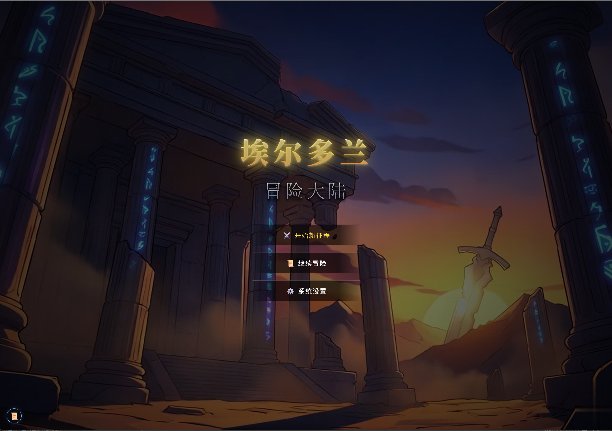
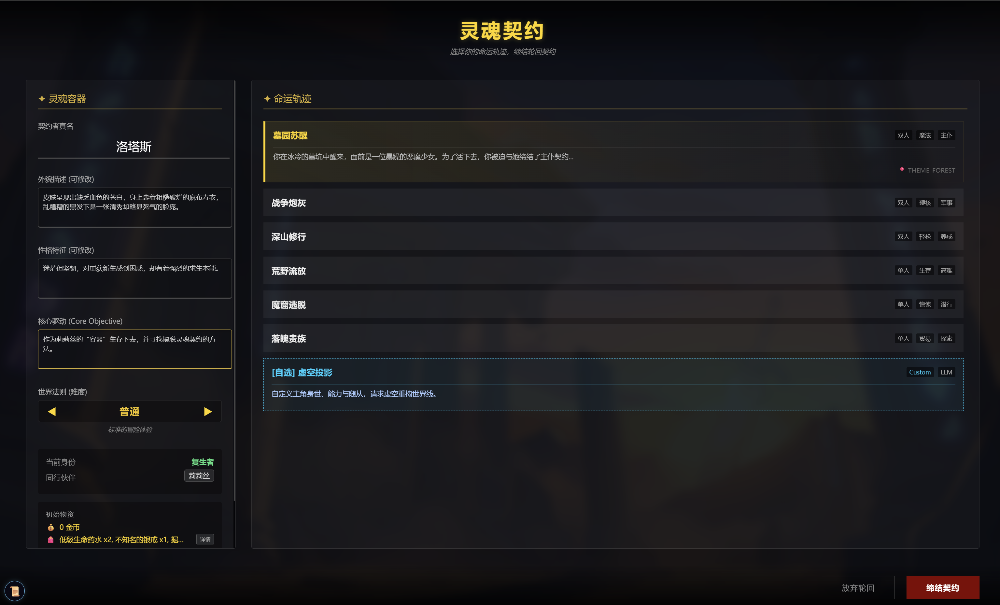
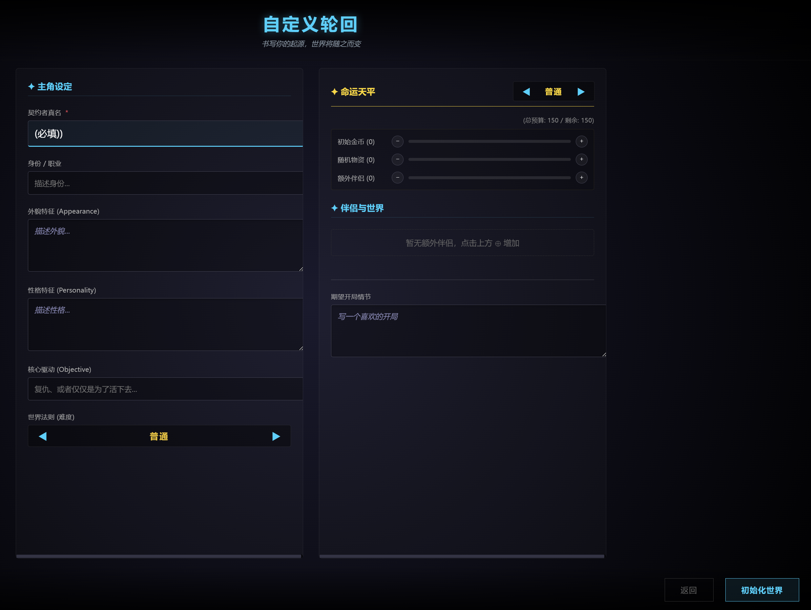
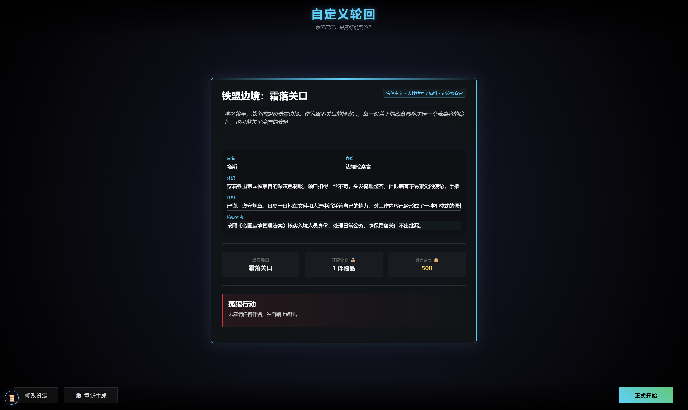
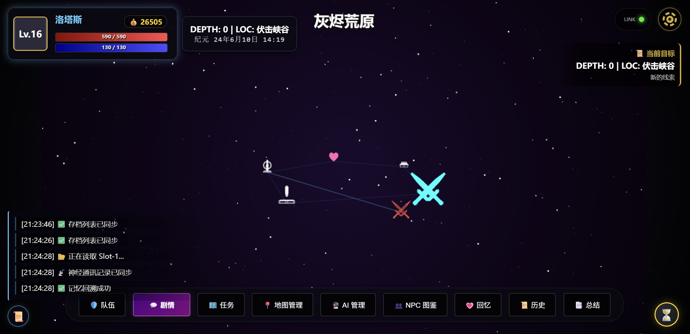
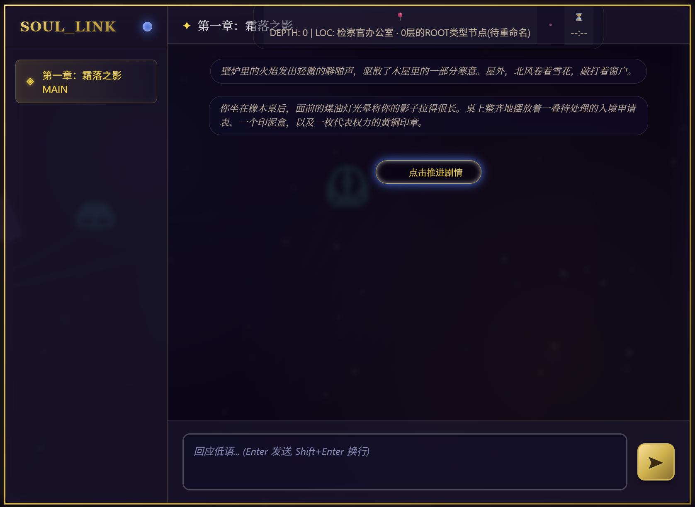
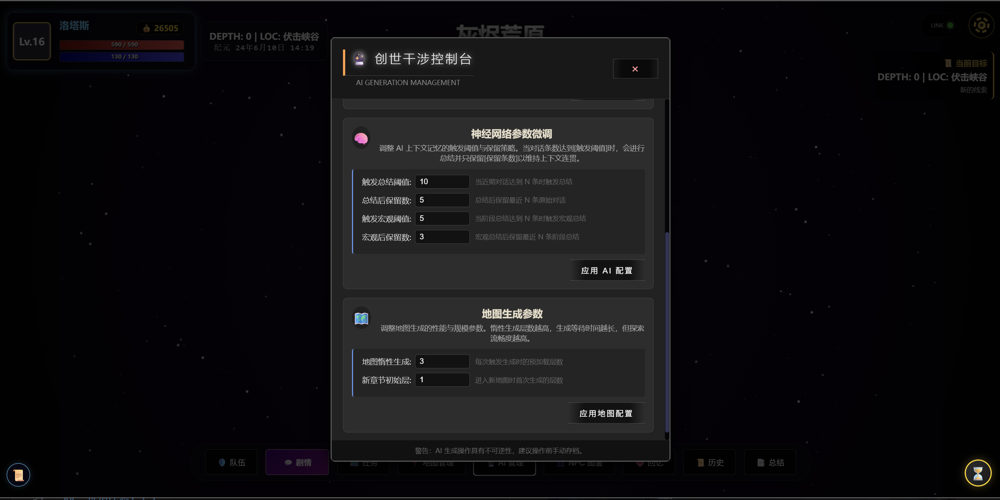
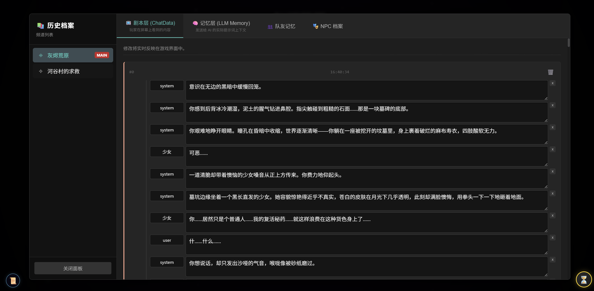
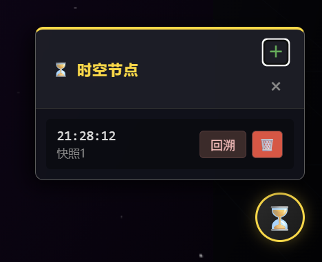
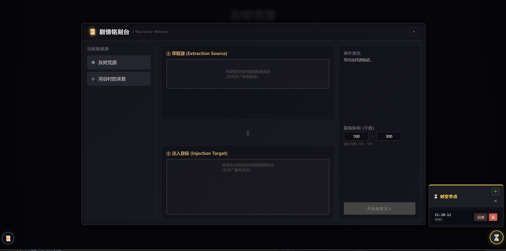

# Eldoran (埃尔多兰)

**一款基于 Phaser + Vue 的大语言模型驱动的 RPG 类角色扮演游戏。**
**A Large Language Model (LLM) driven RPG developed with Phaser and Vue.**

---

## 📖 项目介绍 / Introduction

在游戏里面你可以扮演任何你想要的角色。
In this game, you can role-play as any character you desire.



---

## 🚀 游戏功能 / Game Features

### 1. 自定义开局 (Custom Opening)
在中世纪剑与魔法的大背景下，扮演任何你想要的角色。除了游戏默认的几种开局，你还可以选择自定义开局，让 LLM 开启你的旅途。
Set in a medieval background of swords and magic, play as any character you want. In addition to the default scenarios, you can choose a custom opening and let the LLM start your journey.





### 2. 地图探索 (Map Exploration)
游戏为节点探索式地图，地图结构与内容均由 LLM 动态生成。
The game features node-based exploration, where the map structure and content are dynamically generated by the LLM.



### 3. LLM 智能代理 (LLM Agency)
LLM 拥有一定的权利，能够根据用户输入实现不同的功能（生成 NPC、启动战斗、让 NPC 成为队友等）。LLM 不再只是一个“智能对话 NPC”，它能够通过指令，智能地触发游戏的各种系统。
The LLM possesses certain authorities and can execute various functions based on user input (generating NPCs, starting combat, recruiting NPCs as teammates, etc.). The LLM is no longer just a "chatbot"; it can intelligently trigger various game systems via commands.



### 4. Prompt 管理 (Prompt Management)
游戏对话自带大小总结来减少 Token 消耗，同时玩家拥有编辑对话历史、NPC 记忆等权利。
The game includes summary mechanisms to reduce token consumption. Players also have the right to edit chat history and NPC memories.




### 5. 强大的快照系统 (Snapshot System)
LLM 回复出错导致游戏出问题？不用担心，提前使用快照保存当下游戏的所有状态，LLM 出错后使用快照恢复即可。
Worried about LLM errors breaking the game? Use snapshots to save the entire game state in advance. If the LLM glitches, simply restore from a snapshot.



### 6. 总结系统 (Summary System)
游戏对话历史分为“主线 + 多条支线”，主线与支线对话频道独立。如果想要 LLM 知道支线发生的事情，或者觉得对话历史内容太多想要减少 Token 消耗，可以使用总结系统。
The chat history is divided into a main timeline and multiple side branches, with independent channels. Use the summary system to inform the LLM about side-quest events or to reduce token usage when history becomes too long.



### 7. 更多内容，可以下载项目进行体验(For more information, you can download the project for experience)

---

## 💻 安装步骤 / Installation

1.  **Clone the Repository / 克隆仓库**
    使用命令将整个项目文件安装到 SillyTavern 根目录的 `public/` 目录下：
    Run the following command to clone the project into the `public/` directory of your SillyTavern root:
    ```bash
    git clone [https://github.com/WinManApple/Eldoran.git](https://github.com/WinManApple/Eldoran.git)
    ```

2.  **Install Plugin / 安装插件**
    将 `rpg_save_system` 整个文件夹放到 SillyTavern 根目录的 `plugins/` 目录下。
    Move the entire `rpg_save_system` folder to the `plugins/` directory of your SillyTavern root.

3.  **Configure SillyTavern / 配置酒馆**
    打开 SillyTavern 根目录的 `config.yaml` 文件，应用以下设置：
    Open `config.yaml` in the SillyTavern root and apply the following settings:
    * `enableServerPlugins: true` (允许使用后端插件 / Allow server plugins)
    * `enableServerPluginsAutoUpdate: true` (允许后端插件更新 / Allow plugin auto-updates)
    * `disableCsrfProtection: true` (关闭跨站请求伪造保护 / Disable CSRF protection)

4.  **Import & Play / 导入并开始**
    打开 SillyTavern，导入人物卡 `card/埃尔多兰.png`。
    选择合适的破限预设（建议不要带格式限制，仅破防即可），即可开始游玩。（注意：SillyTavern 需要安装“酒馆助手”插件）。
    Open SillyTavern and import the card `card/埃尔多兰.png`. Choose an appropriate Jailbreak (preferably without format restrictions), and start playing. (Note: SillyTavern requires the "Tavern Assistant" plugin).

---

## 🛑 特别注意与安全警告 / Security Warning

1.  **Web Security / 网络安全**
    做了上述设置（特别是关闭 CSRF 保护）后，**最好不要浏览任何可能的恶意网站**。
    After applying these settings (especially disabling CSRF protection), **avoid visiting any potentially malicious websites**.

2.  **Configuration Toggle / 配置切换**
    `enableServerPlugins` 与 `disableCsrfProtection` 个人建议**只在游玩本游戏的时候开启**，其他时候请设置为 **false**。
    I strongly recommend enabling `enableServerPlugins` and `disableCsrfProtection` **ONLY when playing this game**. Set them back to **false** at other times.
    
    > 防止其他人利用恶意网站通过这个设置漏洞来获取或者修改你的酒馆数据。
    > This prevents malicious sites from exploiting these settings to access or modify your SillyTavern data.

---

> [WARNING]
> ## ⚖️ Legal Disclaimer & Content Warning / 法律免责声明与内容警告
>
> **1. Age Restriction / 年龄限制**
> 本项目仅供 **18 岁及以上**（或您所在司法辖区的法定成年年龄）的成年人访问、下载及使用。通过访问本仓库，您即确认您已达到法定成年年龄。
> This project is intended strictly for adults aged **18 and above** (or the legal age of majority in your jurisdiction). By accessing this repository, you confirm that you are of legal age.
>
> **2. Nature of Content / 内容性质**
> **本项目源代码本身不包含任何色情、淫秽或非法的媒体资源（如图片、音频、视频）。** 仓库内的所有代码（.js, .vue, .html 等）仅为游戏逻辑与交互框架。
> **The source code of this project explicitly DOES NOT contain any pornographic, obscene, or illegal media assets.** All code (scripts, UI components, logic) provided herein serves solely as a framework for game mechanics and interaction.
>
> **3. User Responsibility / 用户责任**
> 本项目作为一款大语言模型（LLM）驱动的 RPG 框架，其实际运行内容取决于用户的输入、配置及第三方模型/插件。**开发者不对用户利用本项目生成、展示或传播的任何内容负责。**
> As an LLM-driven RPG framework, the actual content generated during runtime depends on user input, configurations, and third-party models/plugins. **The developer assumes NO responsibility for any content generated, displayed, or distributed by users utilizing this project.**
>
> **4. Limitation of Liability / 免责条款**
> 用户需自行承担使用本项目的所有风险。在任何情况下，开发者均不对因使用或无法使用本项目而导致的任何直接、间接、偶然或后果性的损害（包括但不限于数据丢失、精神损害或法律纠纷）承担法律责任。
> Users assume all risks associated with the use of this project. In no event shall the developer be held liable for any direct, indirect, incidental, or consequential damages (including but not limited to data loss, distress, or legal disputes) arising from the use or inability to use this project.

## 📜 声明 / License

**License & Copyright**

Copyright (C) 2026 WinAppleMan. 

This project is licensed under the **GNU General Public License v3.0**. You are free to copy, modify, and distribute the code as long as the new project is also Open Source under GPLv3.